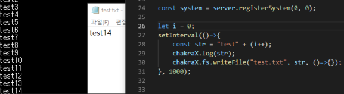

## About This
  
It makes more javascript functions to bedrock_server.exe by injecting DLL  

## Build
It needs [ken](https://github.com/karikera/ken) project on same directory to build.  
  
**[parent directory]**  
├ken(https://github.com/karikera/ken)  
└rechakra(https://github.com/karikera/rechakra)  
  
Outputs are `injector.exe` and `rechakra.dll`.  others are useless in this project.  

## Run with NPM
https://www.npmjs.com/package/bedrock-server-x
```sh
npm i -g bedrock-server-x
cd path/to/bedrock_server
bedrock-server-x
```

## Run with EXE
1. Build it with Visual Studio  
2. Go to build outputs with Prompt
2. `injector.exe "path/to/bedrock_server.exe" rechakra.dll`  
