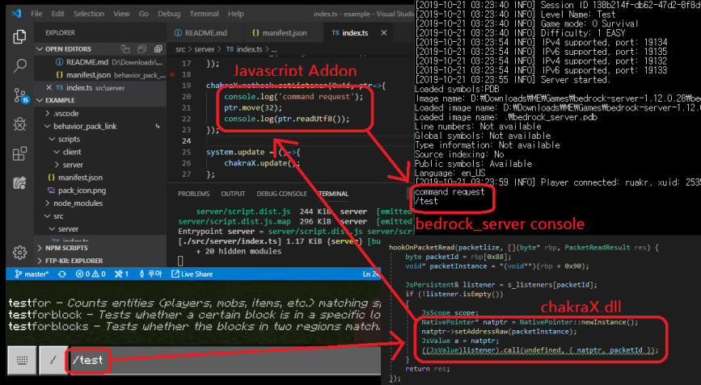

## BDSX: The Server Modding Project!  
It makes more javascript functions to bedrock_server.exe by injecting DLL  
It's very mutable now, I will remove or change API names frequently  

## Install
* Install to existed server
1. Download [bdsx.zip](https://github.com/karikera/bdsx/releases)
2. Unzip to bedrock_server directory
3. run `bdsx.bat`
* Download full server
1. Download []

## Build
It needs [ken](https://github.com/karikera/ken) project on same directory to build.  
  
**[parent directory]**  
├ken(https://github.com/karikera/ken)  
└bdsx(https://github.com/karikera/bdsx)  
  
Outputs are `injector.exe` and `bdsx.dll`.  others are useless in this project.  
You can run it with `injector.exe "path/to/bedrock_server.exe" bdsx.dll`  

## Bedrock Server X: The Server Modding Project!  
  
**Windows Only**  
It injects more javascript APIs to bedrock_server.exe  
It's very mutable now, I will remove or change API names frequently  

## Scripting in Addon
Global script exists in `script/bin`
If it installed correctly, It will print `BDSX: Attached` at first line in console  
And then You can access `bdsx` global variable in Javascript  

* Use it with Webpack  
It recommends to use Webpack  
[My project starter](https://www.npmjs.com/package/mcaddon-start) can make webpack project easily  
You can import it with webpack from `bedrock-server-x` package  

## Example
```ts
// import {bdsx} from 'bedrock-server-x'; // Only for Webpack
// import NativeFile = bdsx.NativeFile; // typescript
const NativeFile = bdsx.NativeFile; // javascript

bdsx.nethook.setOnPacketAfterListener(1, (ptr, networkIdentifier, packetId, info)=>{
    console.log(`${info.id}> Logined`);
    console.log(`${info.id}> XUID = ${info.xuid}`);
    console.log(`${info.id}> IP = ${info.ip}`);
    const file = new NativeFile('loginlog.txt', NativeFile.WRITE, NativeFile.CREATE_ALWAYS);
    file.write(-1, `${new Date}> ${info.id} logined (IP=${info.ip})`, err => {});
    file.close();
});
```

## JS API Reference
```ts

/**
	* Catch global errors
	* default error printing is disabled if cb returns false
	*/
function setOnErrorListener(cb:(err:Error)=>void|boolean): void;

/**
    * Request native debugger
    */
function debug():void;

/**
    * Native console object
    */
const consoleX:{
    /**
        * print message to console
        */
    log(message:string):void;
    /**
        * set text color
        * @param color color bit flags, You can composite like console.FOREGROUND_BLUE | console.FOREGROUND_RED
        */
    setTextAttribute(color:number):void;
    /**
        * get text color
        */
    readonly FOREGROUND_BLUE:number;
    readonly FOREGROUND_GREEN:number;
    readonly FOREGROUND_RED:number;
    readonly FOREGROUND_INTENSITY:number;
    readonly BACKGROUND_BLUE:number;
    readonly BACKGROUND_GREEN:number;
    readonly BACKGROUND_RED:number;
    readonly BACKGROUND_INTENSITY:number;
};

/**
    * Native file, It will open file with CreateFile WinAPI function
    * Must be closed
    */
class NativeFile
{
    /**
        * @param path file path
        * @param access bit flags, NativeFile.WRITE or NativeFile.READ
        * @param creation NativeFile.CREATE_NEW or NativeFile.CREATE_ALWAYS or NativeFile.OPEN_EXISTING or NativFile.OPEN_ALWAYS
        */
    constructor(path:string, access:number, creation:number);
    /**
        * NativeFile must be closed after used
        */
    close(): void;
    /**
        * Read as buffer
        * @param offset position from begin of file
        * @param size reading size
        * @param callback callback, error is zero if succeeded
        * @param buffer true = result is buffer, false = result is string
        */
    read(offset:number, size:number, callback:(error:number, buffer:Uint8Array)=>void, buffer:true):void;
    /**
        * Read as string
        * @param offset position from begin of file
        * @param size reading size
        * @param callback callback, error is zero if succeeded
        * @param buffer true = result is buffer, false = result is string
        */
    read(offset:number, size:number, callback:(error:number, buffer:string, bytes:number)=>void, buffer:false):void;
    /**
        * Write file
        * @param offset position from begin of file
        * @param buffer buffer for writing
        * @param callback callback, error is zero if succeeded
        */
    write(offset:number, buffer:string|ArrayBuffer|ArrayBufferView|DataView, callback:(error:number, bytes:number)=>void):void;
    close():void;

    static readonly WRITE:number;
    static readonly READ:number;
    static readonly CREATE_NEW:number;
    static readonly CREATE_ALWAYS:number;
    static readonly OPEN_EXISTING:number;
    static readonly OPEN_ALWAYS:number;
}

/**
    * for packet listening
    */
const nethook: {
    /**
        * @param packetId Listening packetId, I refer to this document: https://github.com/NiclasOlofsson/MiNET/blob/master/src/MiNET/MiNET/Net/MCPE%20Protocol%20Documentation.md
        * @param listener Callback function, ptr is native pointer of a parsed packet, 
        * Maybe you cannot find any document about the parsed packet structure
        * Just Read It and Print It!
        */
    setOnPacketReadListener(packetId: number, listener: (ptr: NativePointer, networkIdentifier: string, packetId: number) => void | boolean): void;
    setOnPacketAfterListener(packetId: number, listener: (ptr: NativePointer, networkIdentifier: string, packetId: number) => void | boolean): void;
    setOnPacketAfterListener(packetId: 1, listener: (ptr: NativePointer, networkIdentifier: string, packetId: number, loginInfo: { id: string, ip: string, xuid: string }) => void | boolean): void;
    setOnConnectionClosedListener(listener: (networkIdentifier: string)=>void):void;
};

/**
    * for access native pointer
    */
class NativePointer
{
    setAddress(lowBits:number, highBits:number):void;
    move(lowBits: number, highBits?: number): void;
    readUint8():number;
    readUint16():number;
    readUint32():number;
    readInt8():number;
    readInt16():number;
    readInt32():number;
    readPointer():NativePointer;

    /**
        * @param bytes if it's not provided, It will read until reach null character
        */
    readUtf8(bytes?:number):string;
    readBuffer(bytes:number):Uint8Array;
}

enum PacketId;

namespace fs
{
	function writeFile(path: string, content: string): Promise<void>;
	function readFile(path: string): Promise<string>;
}

namespace fsx
{
    writeUtf8FileSync(path: string, content: string): void;
    writeBufferFileSync(path: string, content: Bufferable): void;
    readUtf8FileSync(path: string): string;
    readBufferFileSync(path: string): Uint8Array;
}

```
