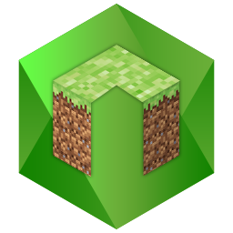
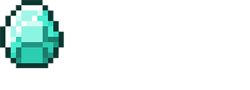

# BDSX : BDS + node.js
  
BDSX is a modification of Minecraft Bedrock Dedicated Server, supporting [node.js](https://nodejs.org/). Because it is based on the offical BDS software, it includes all the features of vanilla Minecraft, but includes other features as well, such as hooking functions and packets to change behavior. 

## Features

* OS: Windows(Recommended), Linux with Wine(Unstable)
* All Minecraft BDS features
* All node.js features (*that are supported by ChakraCore. See [this page](https://github.com/bdsx/bdsx/wiki/Available-NPM-Modules) for more information)
* Debug with Visual Studio Code (You can debug plugins too)
* Intercept network packets
* [Custom Commands](https://github.com/bdsx/bdsx/wiki/Custom-Commands)
* Low-level hooking and [DLL Call](https://github.com/bdsx/bdsx/wiki/Call-DLL-Directly)
* Get IP Address & XUID (Example below)

```ts
import { events } from "bdsx/event";
import { MinecraftPacketIds } from 'bdsx/bds/packetids';
events.packetAfter(MinecraftPacketIds.Login).on((ptr, networkIdentifier, packetId)=>{
    const ip = networkIdentifier.getAddress();
    if (ptr.connreq === null) return; // Wrong client version
    const cert = ptr.connreq.getCertificate();
    const xuid = cert.getXuid();
    const username = cert.getId();
    console.log(`Connection: ${username}> IP=${ip}, XUID=${xuid}`);
});
```

## Usage
* Requirements
    * [node.js](https://nodejs.org/) Please make sure your node is up to date.
    * [GIT](https://git-scm.com/download)
    * Wine (if using Linux)
* Recommended  
    * [VSCode](https://code.visualstudio.com/)

To download, clone the repo:
```bash
git clone https://github.com/bdsx/bdsx.git
```

### Debug & Launch with VSCode
When starting BDSX with VSCode, you need to
1. Open the project with VSCode
2. Install the legacy debugger. the suggestion dialog will be opened up on the right bottom corner.
3. Open a terminal (Ctrl+Shift+｀)
4. Run `npm i` to install npm packages and BDS
5. Press `F5` to build and run in VSCode

### Launch with the executable
Run `bdsx.bat` (or `bdsx.sh` on Linux) to start BDSX

### Manual instruction of the executable
1. Open a terminal to the bdsx folder
2. Run `npm i` to install npm packages and BDS
3. Use `tsc` to compile the typescript and use `bedrock_server.exe ..` in the `bedrock_server` directory. If on Linux, use `wine bedrock_server.exe ..` instead. 

## File Structure
```sh
[bdsx project]
├ [bdsx] # Core Library
├ [example_and_test] # Examples for using the BDSX API and tests of the BDSX API
├ [bedrock_server] # BDS installation
├ launcher.ts # Script for launching BDS
├ index.ts # Main entry point. This file is required by the launcher when BDS is fully started.
├ bdsx.sh # Executable for Linux
└ bdsx.bat # Executable for Windows 
```
> Please start your own code from ./index.ts

> By default index.ts imports example_and_test. To disable the examples simply remove the import or replace it with your own code.

> For examples, see the `example_and_test` folder. There are some plugins available on npm in the @bdsx organization as well.  

## Make a bdsx plugin
Please check [`plugin-example/README.md`](plugin-example/README.md).

## Discord
https://discord.gg/pC9XdkC

## BDSX Discussions
https://github.com/bdsx/bdsx/discussions

## BDSX Wiki
https://github.com/bdsx/bdsx/wiki

## Hosting Support
[ https://easyminecrafthosting.com/](https://easyminecrafthosting.com/) (Latin America)

## Docker Image
https://hub.docker.com/r/karikera/bdsx

## Bug Report
https://github.com/bdsx/bdsx/issues

## BDSX Core
https://github.com/bdsx/bdsx-core
